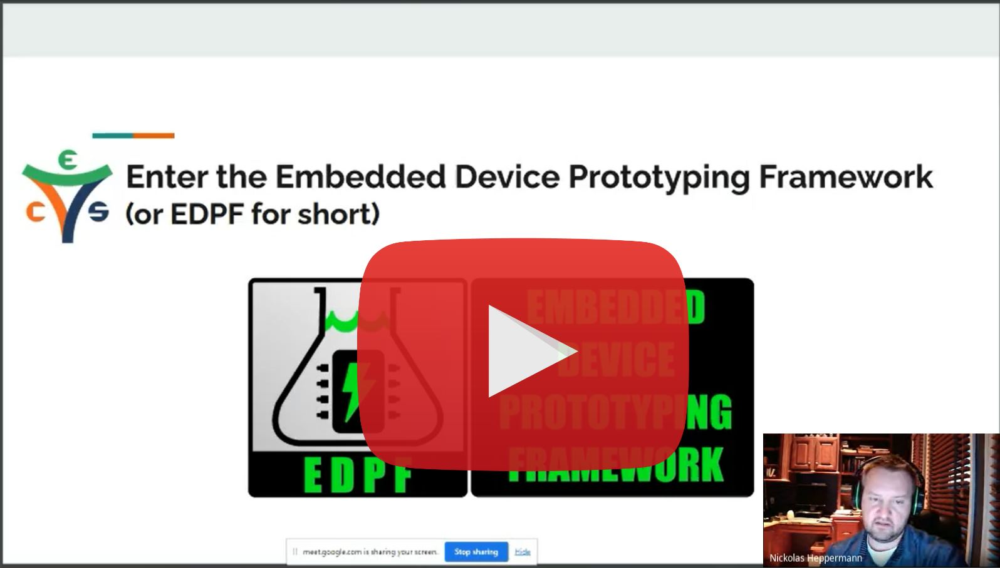
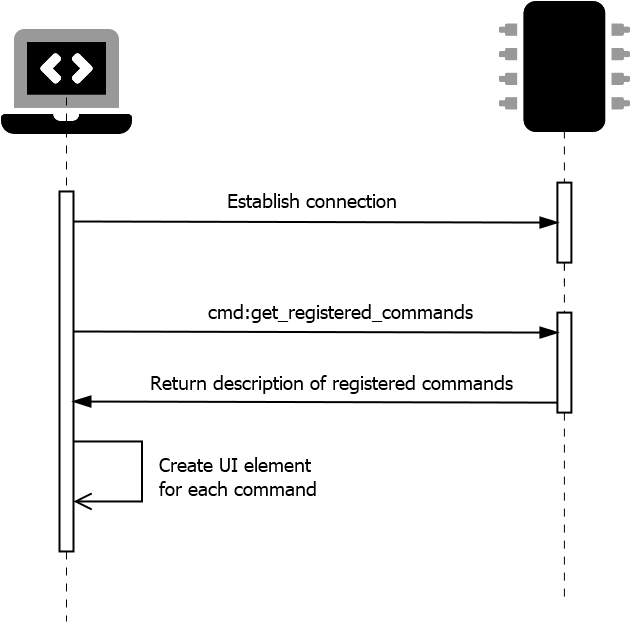

  
<!--TODO: add gifs of host tools, link to host section below-->
# Embedded Device Prototyping Framework
##  Less boilerplate coding, more productive prototyping, faster project completion

Embedded Device Prototyping Framework (EDPF) is an embedded device rapid prototyping framework. A lot of time and effort can be spent simply establishing communication back and forth from a host PC to an embedded device uPC.  This framework establishes a base infrastructure that removes much of that plumbing work off the backs of developers/designers/hobbyists/etc.  This design has been used in numerous applications for both commercial and hobbyist purposes.  Please make use of it yourself if it can lighten your load, help you complete your task, and get to what matters in your device -- completing your design.

## Video Overview
If you would like to watch a video overview of this project, 
<a href="https://www.youtube.com/watch?v=P5Ys7X5QqWg?t=519">please follow this link
</a>

Slides for the [presentation can be found here](https://electroniccomputing.com/slides#edpf_overview).

---
## Table of Contents (this doc)
* [Project Philosophy](#id-proj-philosophy)
* [Main Features](#id-main-features)
  * [Firmware for Rapid Prototyping](#id-firwmare-rapid)
  * [Host Machine Software for Rapid Prototyping](#id-software-rapid)
* [Host Machine Software Tools](#id-hostapp-tools)
   * [Charting](#id-tool-charting)
   * [Console](#id-tool-console)
   * [Device Commands](#id-tool-devicecommands)
   * [Connections](#id-tool-connections)
   * [Macros](#id-tool-macros)
   * [Logging](#id-tool-logging)

---
## Other Important ReadMe's (not this doc)

:link: [Getting Started](./getting_started.md)

:link: [Compatibility: Devices, Software, Firmware, Host Machine](./compatibility_devices_software_host_machine.md)

:link: [Host PC to Embedded Device IO](./host_pc_to_embedded_device_io.md)

:link: [What are Commands?](./device_commands.md#id-what-are-commands)

:link: [How to create custom commands](./device_commands.md#id-create-custom-commands)

---

##  Project Philosophy
* Low code through reduced boilerplate - EDPF strives to reduce the code needed to create new functionality in both firmware and software
* Open source with examples of common functionality
* Easily extendable for custom applications

---

## What are its main features?

The EDPF provides a powerful combination of [Embedded Firmware](#id-firwmare-rapid) & [Host Machine Software](#id-software-rapid) to empower its users to rapidly prototype new devices.

###  Firmware for Rapid Prototyping

*  Handshaking to establish a connection
*  Easy IO between the device and the host application
*  Commands and parameters make it easy for the device to accept data from the host application software and invoke firmware functionality 

###  Host Machine Software for Rapid Prototyping

The software on the host machine configures itself to facilitate the functionality offered by the firmware.  When a connection is established from the host software to the firmware, the host software queries the firmware for the commands supported by the firmware.  The firmware responds by describing the commands, and the UI sets up custom controls to support each command.

  
---

  

## Host Machine Software Tools

The host machine software has a number tools that can be used for operating with the device.  Let's do a run down on the tools.

###  Charting Tool
Charts the flow of device data. Read more about the [Charting Tool](./tool-charting.md).

###   Console Tool
The EDPF software makes the device act like a server that provides a terminal interface.  Read more about the [Console Tool](./tool-console.md).
  

###  Device Commands Tool
Send data and execute instructions, much like a software program calls methods. The host application queries the attached device to learn of its capabilities and automatically creates UI elements to easily interact with device functionality. Read more about the [Device Commands Tool](./tool-devicecommands.md).

###  Connections Tool
Establish connections to devices over multiple connection options.  Read more about the [Connections Tool](./tool-connections.md).
 

###  Macros Tool
Send multiple operations to the device with optional time delays in between. Supports both oneshot and looping macros on a timer. Read more about the [Macros Tool](./tool-macros.md).

###  Logging Tool
Interact with the device as if it were a server that provides a terminal interface. The device responds with easy to understand text in a 'human readable' format. Read more about the [Logging Tool](./tool-logging.md).