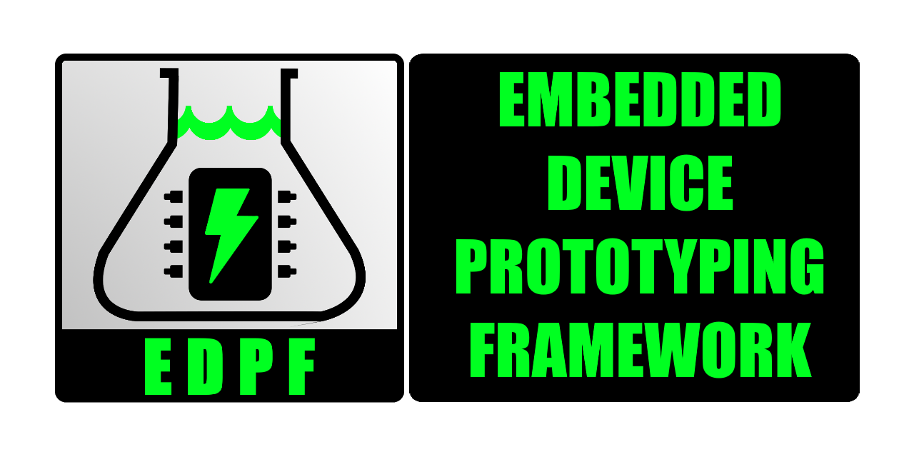

  
TODO: add gifs of host tools, link to host section below
# Embedded Device Prototyping Framework
Embedded Device Prototyping Framework (EDPF) is an embedded device rapid prototyping framework. A lot of time and effort can be spent simply establishing communication back and forth from a host PC to an embedded device uPC.  This framework establishes a base infrastructure that removes much of that plumbing work off the backs of developers/designers/hobbyists/etc.  This design has been used in numerous applications for both commercial and hobbyist purposes.  Please make use of it yourself if it can lighten your load, help you complete your task, and get to what matters in your device -- completing your design.

---
## Table of Contents (this doc)

* [Main Features](#id-main-features)
  * [Project Philosophy](#id-proj-philosophy)
  * [Firmware for Rapid Prototyping](#id-firwmare-rapid)
  * [Host Machine Software for Rapid Prototyping](#id-software-rapid)

---
## Other Important ReadMe's

:link: [Getting Started](./getting_started.md)

:link: [Compatibility: Devices, Software, Host Machine](./compatibility_devices_software_host_machine.md)

:link: [Host PC to Embedded Device IO](./host_pc_to_embedded_device_io.md)

---
<a id='id-main-features' />

## What are its main features?

The EDPF provides a powerful combination of [Embedded Firmware](#id-firwmare-rapid) & [Host Machine Software](#id-software-rapid) to empower its users to rapidly prototype new devices.

<a id='id-proj-philosophy' />

###  Project Philosophy
* Low code through reduced boilerplate
  * EDPF strives to reduce the code needed to create new functionality in firmware 
* Open source with examples of common functionality
* Easily extendable for custom functionality

<a id='id-firwmare-rapid' />

###  Firmware for Rapid Prototyping

*  Handshaking to establish a connection
*  Easy IO between the device and the host application
  *  Commands and parameters make it easy for 

<a id='id-software-rapid' />

###  Host Machine Software for Rapid Prototyping

* Easy IO 

* Host App (PC) Prototyping UI (.NET WinForms)
  * Easily extendable for custom functionality
  * Multiple interfaces to the embedded device
    * Terminal style command line interface
    * Common UI elements (buttons and numeric inputs) for executing multiple step communication tasks with the device
  * Built in logging

* Host Device library (.NET)
  
  * Provides core IO methods which handle establishing connection, sending instructions, receiving acknowledgements, and return data payloads 

* Command line driven communication protocol (protocol runs over RS232)
  * Easily extendable for custom functionality
  * Intuitive, human readable IO

* Firmware kernel (Arduino and other compatible devices)
  * Easily extendable for custom functionality
  * Handles routing command line IO to device subroutines along with parameters

