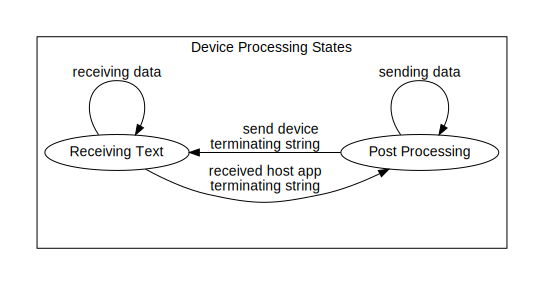

# Embedded Device Prototyping Framework
Embedded Device Prototyping Framework (EDPF) an embedded device rapid prototyping framework. A lot of time and effort can be spent simply establishing communication back and forth from a host PC to an embedded device uPC.  This framework establishes a base infrastructure that removes much of that plumbing work off the backs of developers/designers/hobbyists/etc.  This design has been used in numerous applications for both commercial and hobbyist purposes.  Please make use of it yourself if it can lighten your load, help you complete your task, and get to what matters in your device -- completing your design.

Currently EDPF focuses on Arduino devices, RS232 (default Arduino USB IO mechanism), and Microsoft's .NET libraries.

## What are its main features?

* Host App (PC) Prototyping UI (.NET WinForms)
  * Easily extendable for custom functionality
  * Multiple interfaces to the embedded device
    * Terminal style command line interface
    * Common UI elements (buttons and numeric inputs) for executing multiple step communication tasks with the device
  * Built in logging

* Host Device library (.NET)
  * Easily extendable for custom functionality
  * Provides core IO methods which handle establishing connection, sending instructions, receiving acknowledgements, and return data payloads 

* Command line driven communication protocol (protocol runs over RS232)
  * Easily extendable for custom functionality
  * Intuitive, human readable IO

* Firmware kernel (Arduino and other compatible devices)
  * Easily extendable for custom functionality
  * Handles routing command line IO to device subroutines along with parameters

## State Diagrams
Let's take a look at how this works

### Host Device State Diagram

### Embedded Device State Diagram

