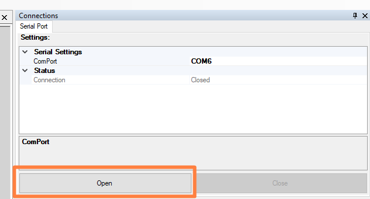

# Getting Started
To execute the EDPF, one needs to prepare both the software that runs on the host PC and the firmware that runs on the device.

---
###  1. Compile and Upload Device Firmware

Currently, only Arduino devices are supported ([see here for compatibility list](compatibility_devices_software_host_machine.md)).  Use the [Arduino IDE](https://www.arduino.cc/en/software) to compile and upload the firmware to your device.

Click [here for the firmware root.](./Device/BaseKernelDevice/)

---
###  2. Compile and Execute Host Machine Software

The host PC software is based on the .NET 4.8 framework, and it is recommended to use [Visual Studio 2019 (Community Edition or higher)](https://visualstudio.microsoft.com/downloads/) or [VS Code](https://code.visualstudio.com/download) to compile and execute the host PC sofware.

Click [here for the software root.](./PC/HostApp)

---
###  3. Establish a Connection with the Host Machine Software

With the application running, click the 'Open' button on the 'Connections' tool.

  
After the connection is established, other tools in the host application become enabled for interaction ('Console' tool shown below). 

###   4. Prototype!!!

Create stuff, test, give feedback on how to make the tool better, go back to 'Create stuff'.