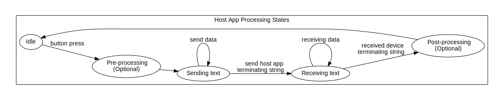

# Host PC to Embedded Device IO

### State Diagrams

The host software application is the master, and the embedded device is the slave.  The embedded device will not output data or change configuration unless the host application commands it.  The embedded device operates much like a command line terminal found in many operating systems.  The device waits for a collection of characters followed by a carriage return and inspects the input characters for known commands and optional arguments.  

Let's take a look at how this works.

### Host Application State Diagram

The host application uses both the textual input and button clicks to queue 1 or more commands to the device.  Here are the states and signals:
* State: Idle - until text is input or a button is clicked the host app remains idle and does not send any text to the device
* Signal: Button press - upon button press host app will start transitioning to other states
* State: Pre-processing (optional) - depending on the button some pre-processing calculations may occur in the host app
* State: Sending text - the host app sends the command and optional argument(s) to the device
* Signal: Send host app terminating string - for the last bytes sent, the host app sends a terminating string to the device
* State: Receiving text - After the terminating string, the host app relinquishes control to the embedded device and begins receiving data
* Signal: Receiving data - The host app collects data from the embedded device and remains in the receiving data state until it receives the device terminating string
* Signal: Received device terminating string - Upon receipt of the device terminating string the host app once again assumes control of the flow of data.  This signal results in the host app transitioning back to the Idle state.
* State: Post-processing (optional) - depending on the button some post-processing caclulations may occur in the host app.  Also some UI elements may be set.

### Embedded Device State Diagram

Here are the states of the embedded device.  The embedded device state diagram looks similar to the host app diagram except for it spends more time listening than sitting idle.  Here are the states and signals:
* State: Receiving text - the device receives data from the host application polling the RS232 input and buffering text until the host app terminating string is received
* Signal: Received host app terminating string - upon receipt of the host app terminating string, the device assumes control of the flow of device <--> host text IO
* State: Post processing - the device decodes the commands and optional argument(s) to perform the actions invoked by the host app.  The device will send data to the host app echoing back the command it received and optionally sending command specific response data.  For instance, a command can invoke the device to read sensor values so both the original command followed by the sensor data will be returned
* Signal: Send device terminating string - lastly the device will send the device terminating string, which signals to the host app to once again assume control of the device <--> host text IO.  The device transitions back to the Receiving text state.

